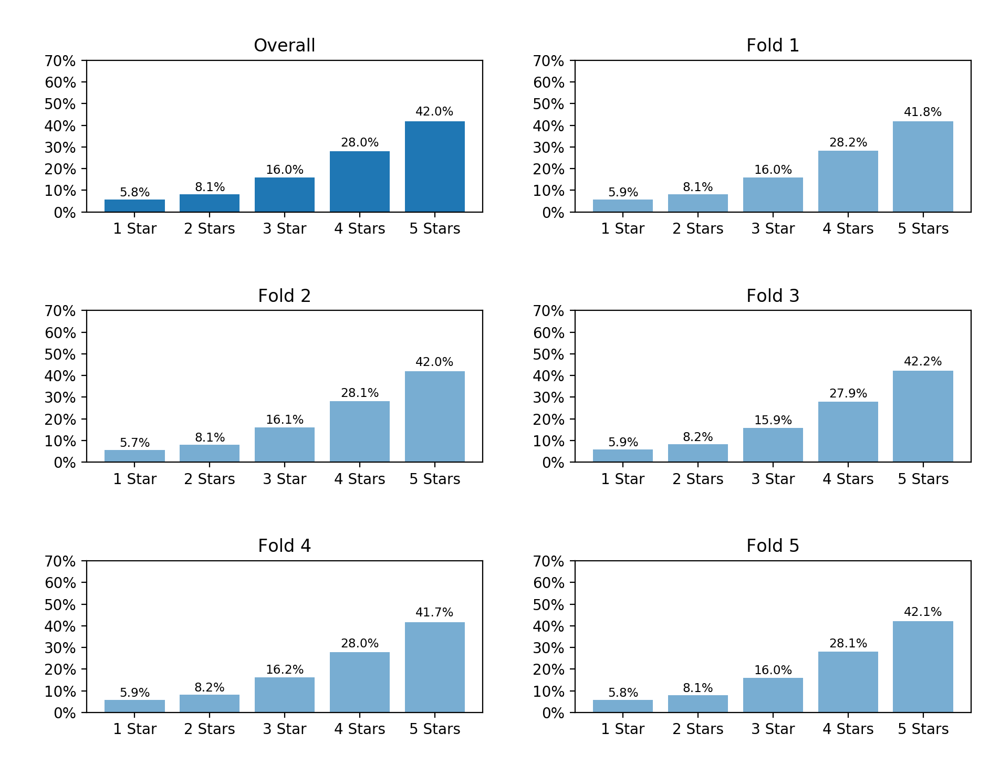

# 5-fold

This is supposed to be used for 5-fold cross validation. We run the evaluation process 5 times, each time we select 4 groups for training, and 1 group for testing. In the end, we take the average of all accuracy measurements as the final result.

For example, in round 1, we can select 1, 2, 3, 4 for training a model, 5 for verification. The next round, we may select 1, 2, 3, 5 for training, and 4 for verification.

Each group has exact 40,000 reviews ordered by score, then document index. No two groups have common reviews (no duplicates).

Each file has 3 columns, column 1 to 3 are: Document index, score and review text using word indices.

Scores distribution for all reviews and each group is shown below.

Review length distribution for all reviews of each group is shown below.

